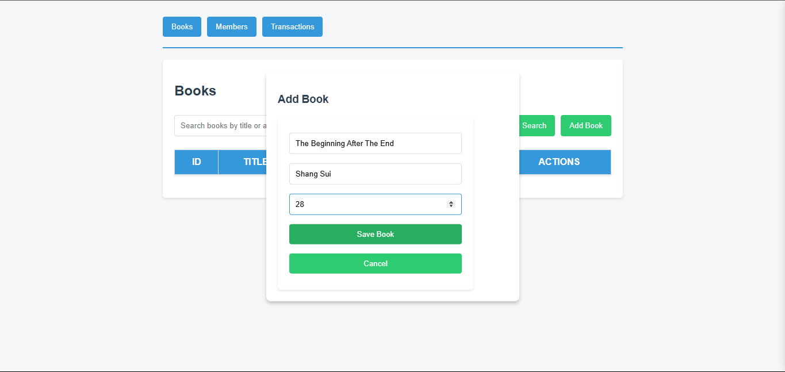
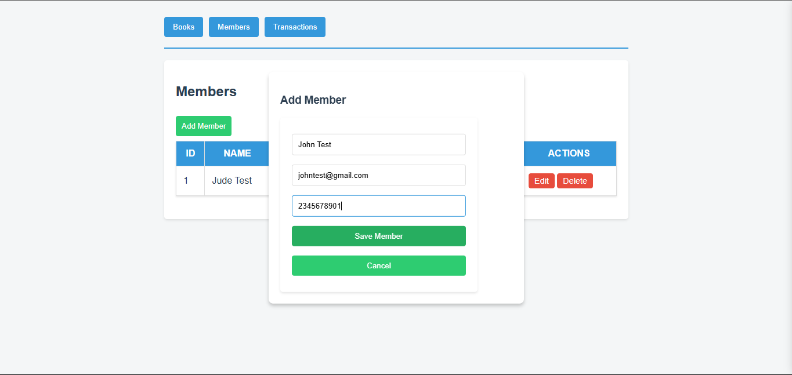
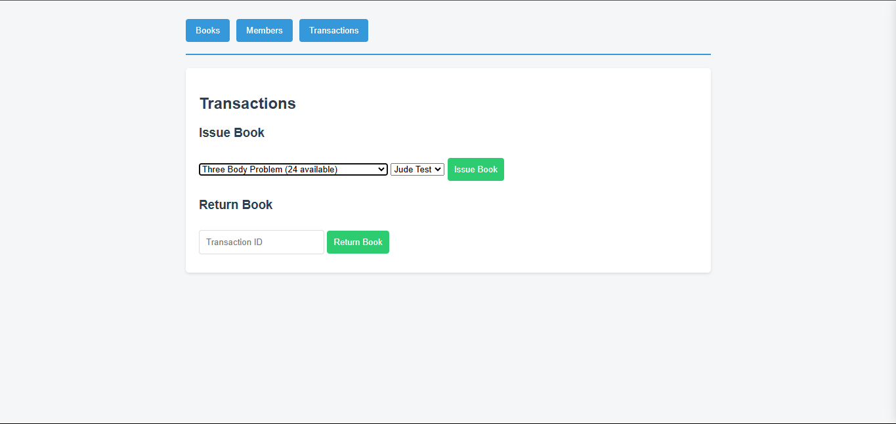
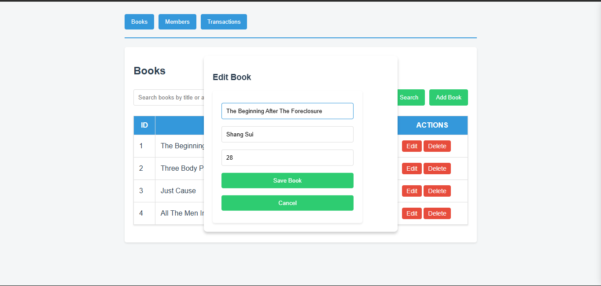
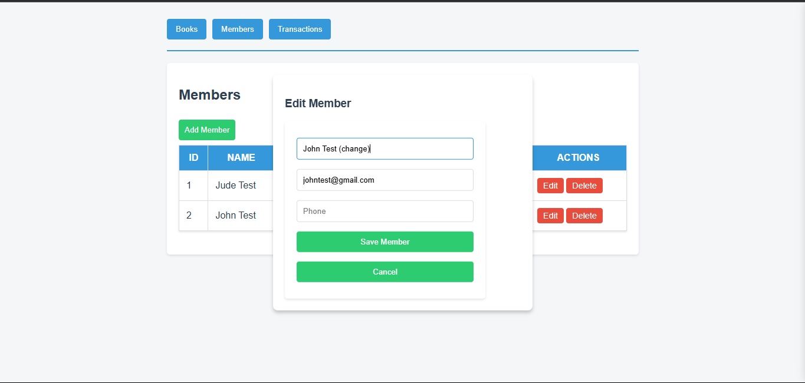
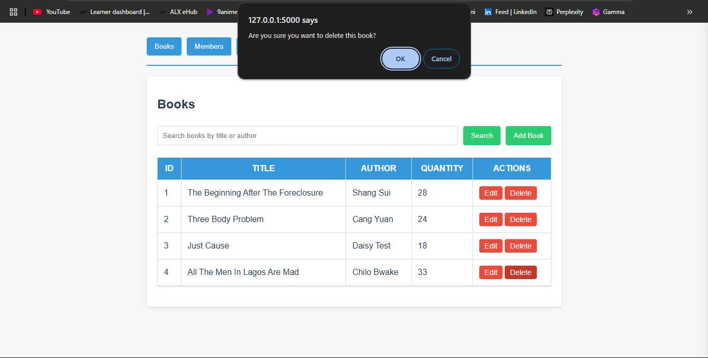
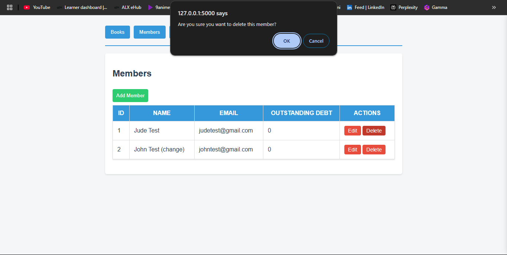
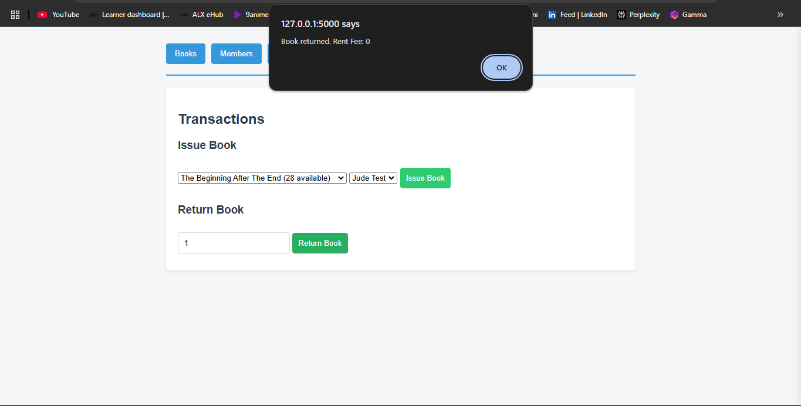

# Library Management System

## Description

A comprehensive system for managing library operations, including book inventory, member management, and circulation tracking.

## Features

- Book Catalog Management
- Member Registration and Management
- Fine Calculation
- Search and Filter Books

## Installation

```bash
Fork the repository

# Clone repository
git clone https://github.com/YOUR_USERNAME/library_management_system.git

# Install dependencies
pip install -r requirements.txt

# Start application
python3 app.py
```

## Usage

By default, available books and members are drawn up and are viewable upon starting the application.

1. Add books to catalog


2. Register library members


3. Issue a book to a member


4. Update a book


5. Update a member


6. Delete a book


7. Delete a member


8. Manage fines and payments


## API Endpoints

| Endpoint | Method | Description |
|----------|---------|-------------|
| `/api/books` | GET | Retrieve all books |
| `/api/books/<id>` | GET | Get book by ID |
| `/api/books` | POST | Add new book |
| `/api/books/<id>` | PUT | Update book details |
| `/api/books/<id>` | DELETE | Remove book |
| `/api/members` | GET | List all members |
| `/api/members/<id>` | GET | Get member by ID |
| `/api/members` | POST | Register new member |
| `/api/members/<id>` | PUT | Update member info |
| `/api/members/<id>` | DELETE | Remove member |
| `/api/loans` | POST | Issue book to member |
| `/api/returns` | POST | Process book return |

## Contributing

Pull requests welcome. For major changes, open an issue first.

## License

This project is Licensed by [MIT](https://choosealicense.com/licenses/mit/)

## Conclusion

The Library Management System provides a robust solution for modern libraries, streamlining daily operations and enhancing user experience. With its comprehensive features and user-friendly interface, it helps librarians efficiently manage resources while serving their community better.

Thank you for visiting the repository!!
